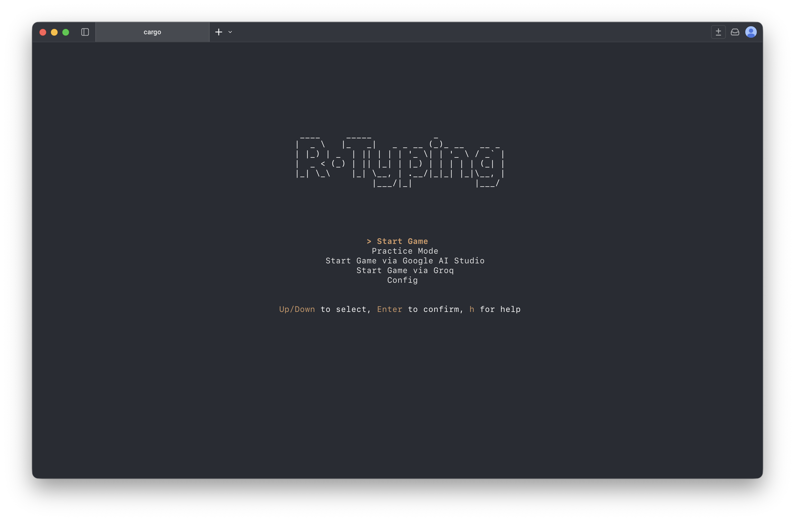
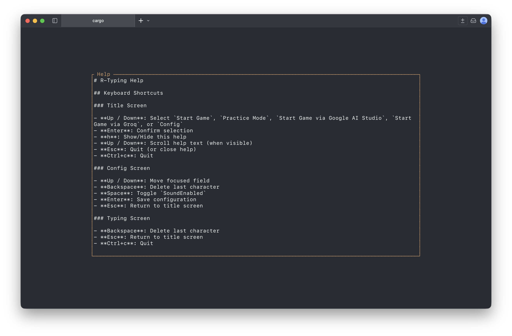
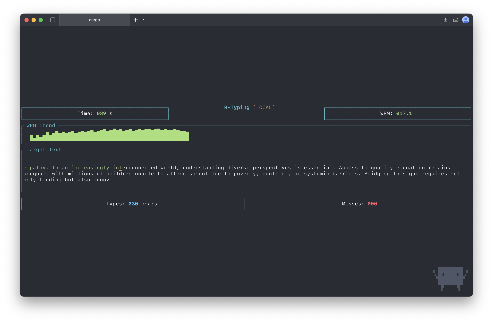
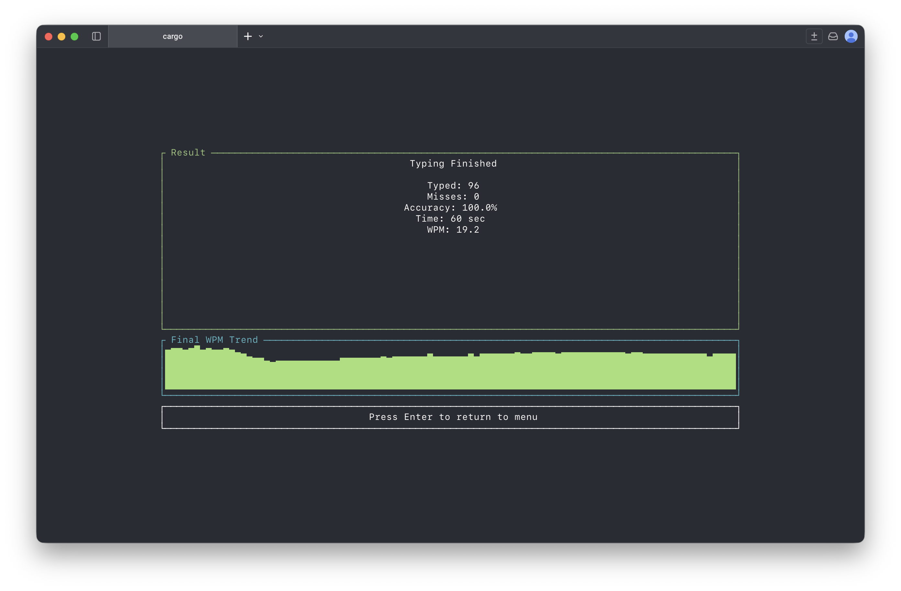

# ⌨️ R-Typing - Typing Program 🦀

## 📖 Overview

R-Typing is a terminal-based typing practice application created as a learning project for Rust. The app is designed with simplicity in mind, focusing on essential features for a fun and educational experience.

I\’m still learning Rust, so feedback and corrections are very welcome!






## ⚙️ How to Run in VSCode

1. Open the main file in VSCode.
2. Click the `▶ Run` button above the `fn main()` function.
3. Alternatively, run the following commands in the terminal:

```shell
# Default
cargo run

# or
cargo run -- --timeout 30 --level 20 --sound
```

## 🔨 Build and Install

To build and install the application in your `~/.cargo/bin/` directory:

```shell
cargo check
cargo build --release
cargo install --path .
```

## 💻 Usage

```text
R-Typing: A terminal-based typing app.

Usage: rtyping [OPTIONS]

Options:
  -t, --timeout <TIMEOUT>  Seconds [default: 60]
  -l, --level <LEVEL>      Number of words [default: 30]
      --freq <FREQUENCY>   Frequency e.g, 880.0 or 480.0 [default: 80.0]
  -s, --sound              Enable BGM
  -h, --help               Print help
```

## ✅ Features

### Completed Features

- [x] Timeout functionality during user input.
- [x] Accept user input.
- [x] Display words on the screen.
- [x] Use Rust's basic random functions.
- [x] Add decorative strings to enhance visuals.
- [x] Display a countdown timer.
- [x] Resolve Backspace handling issues in raw mode.
- [x] Calculate WPM (Words Per Minute).
- [x] Add background music (BGM) using `rodio`.
- [x] Include sound effects for typing.
- [x] Handle external asset files during build.
- [x] Restore terminal state after exiting raw mode.
- [x] Add command-line options for customization (`clap`).
- [x] Validate command-line arguments.
- [x] Change cursor style when user input.
- [x] Generate sentence with Markov Chain (n-gram).
- [x] TUI implementation with `ratatui`.

## 🔖 Appendix

### 🛠 Cross-Compilation Instructions

For Apple silicon

```shell
rustup target add aarch64-apple-darwin
cargo build --release --target=aarch64-apple-darwin
```

For Windows (x86_64)

```shell
rustup target add x86_64-pc-windows-gnu
cargo build --release --target=x86_64-pc-windows-gnu
```
