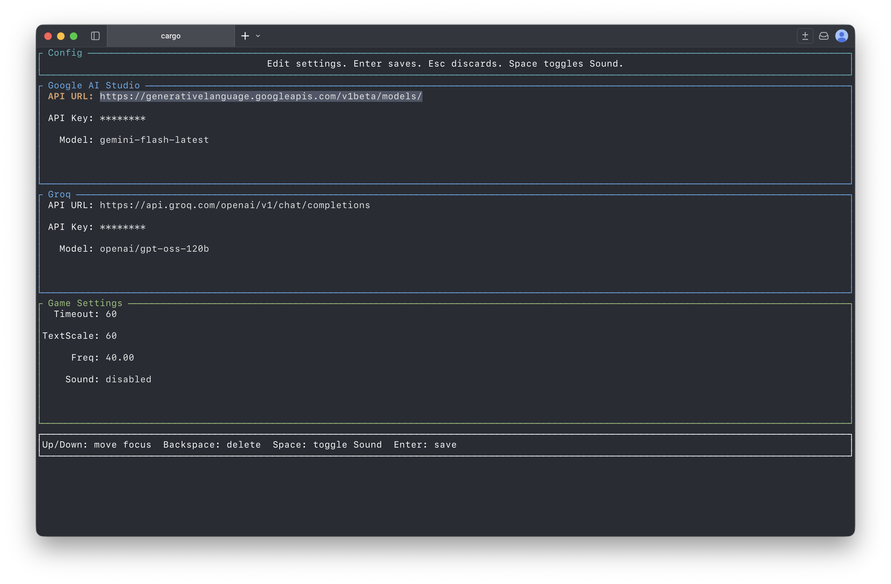

# R-Typing

R-Typing is a terminal-based typing game built with Rust. It provides a TUI powered by `ratatui` and `crossterm`, real-time WPM feedback, optional audio, and multiple text generation sources.

The game starts from a title menu where you can choose a generation source and play mode. All settings are configured through the in-app Config screen and saved to disk.




## Features

- Terminal UI with title menu, config screen, typing screen, result screen, and stats screen
- Real-time WPM, timer, typed character count, and miss count
- Timed history with best WPM, average WPM, average accuracy, recent WPM trend, and frequent missed characters
- Practice mode (no time limit) via menu or by setting timeout to 0
- Optional BGM and typing feedback sound (configured in-app, saved to disk)
- Local text generation with a 4-gram Markov chain
- Remote text generation through Google AI Studio or Groq
- All settings and timed history saved under `~/.config/rtyping/`

## Run

```shell
# Start normally and choose a provider from the title menu
cargo run
```

## Build

```shell
cargo build
cargo build --release
cargo install --path .
```

## Title Menu

- Menu entries:
  - `Start Game`
  - `Practice Mode`
  - `Start Game via Google AI Studio`
  - `Start Game via Groq`
  - `Stats`
  - `Config`
- `Up / Down`: move between the six menu entries
- `Enter`: confirm selection
- `h`: open or close help
- `Esc`: quit
- `Ctrl+c`: quit
- The selected entry is marked with `▶︎`

## Config Screen

The `Config` screen lets you edit both Google AI Studio and Groq provider settings and game settings.

Each provider has these fields:

- `API URL`
- `API Key`
- `Model`

Game Settings:

- `Timeout` – timer duration in seconds (`0` = no time limit / practice mode)
- `TextScale` – target text length scale
- `Freq` – typing sound frequency in Hz
- `SoundEnabled` – `true` / `false`

Controls:

- `Up / Down`: move focus
- `Left / Right`: move the input cursor inside the focused text field
- Character keys: insert at the current cursor position
- `Backspace`: delete the character before the cursor
- `Space`: toggle `SoundEnabled`
- `Enter`: save configuration
- `Esc`: return to the title screen

API key fields stay masked while editing, with one mask character per stored character.

Saved files:

- `~/.config/rtyping/config.json`
- `~/.config/rtyping/config.key`
- `~/.config/rtyping/history.json`

`config.json` stores encrypted API key data. The encryption key is stored separately in `config.key`.

`history.json` stores completed timed-session results. Practice Mode results are not saved to history.

## Typing Screen

The `Target Text` block keeps two blank lines above and two blank lines below the target text, including when the text wraps across multiple lines.

The WPM trend block uses a light yellow border while keeping the graph line colors unchanged.

## Result and Stats

The `Result` screen shows the current session summary:

- WPM
- Accuracy
- Miss count
- Elapsed input time
- Generation source
- Practice or timed mode

For timed sessions, the result is saved to `~/.config/rtyping/history.json`.

The `Result` and `Stats` screens also show saved timed-history stats:

- Best WPM
- Average WPM
- Average accuracy
- Recent 10-run WPM trend
- Frequent missed characters, counted by the expected character

Controls on the `Stats` screen:

- `Enter / Esc`: return to the title screen

## Provider Notes

### Google AI Studio

- The final request URL is built as `API URL/` + `Model` + `:generateContent`
- The API key is appended as the `key` query parameter

Example:

```text
API URL: https://generativelanguage.googleapis.com/v1beta/models
Model: gemini-2.0-flash
Final URL: https://generativelanguage.googleapis.com/v1beta/models/gemini-2.0-flash:generateContent?key=YOUR_API_KEY
```

### Groq

- `API URL` should be the full chat completions endpoint you want to call
- `Model` is sent in the request body
- `API Key` is sent as a bearer token

## Text Length

The generated target text length is controlled by `TextScale` in the Config screen. The current implementation uses roughly `text_scale * 5` characters for both local and remote generation.

## Development

```shell
cargo fmt
cargo test
```

## Cross Compilation

For Apple silicon macOS:

```shell
rustup target add aarch64-apple-darwin
cargo build --release --target=aarch64-apple-darwin
```

For Windows x86_64 GNU:

```shell
rustup target add x86_64-pc-windows-gnu
cargo build --release --target=x86_64-pc-windows-gnu
```

## Harness Engineering

Codex CLI と Copilot CLI 向けにハーネスを導入しました。GPT-5.4-Mini でも一定の品質が保てるようになりました。
