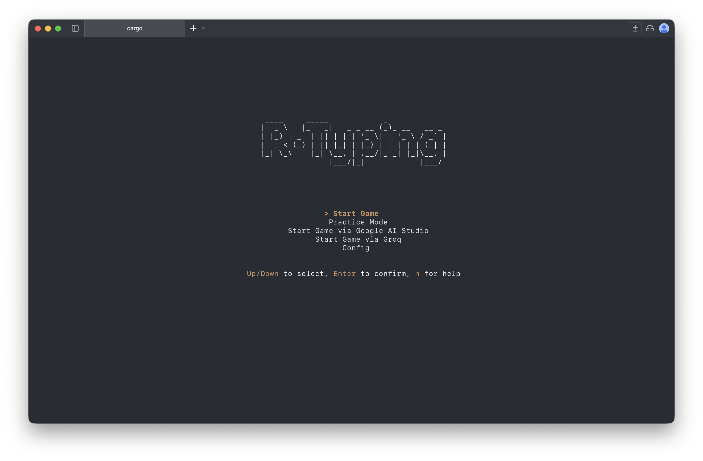
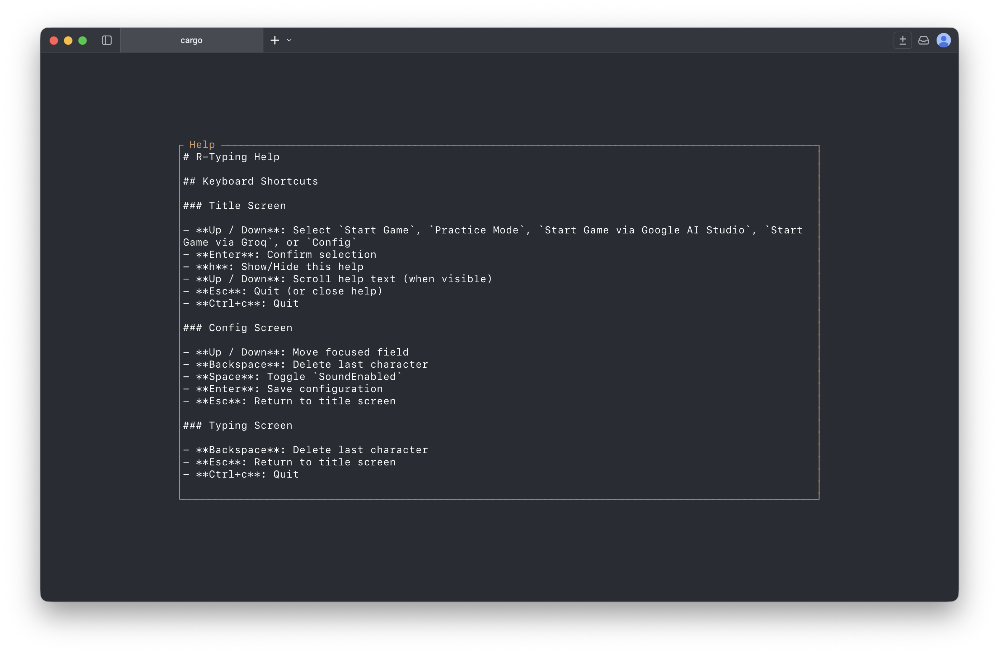
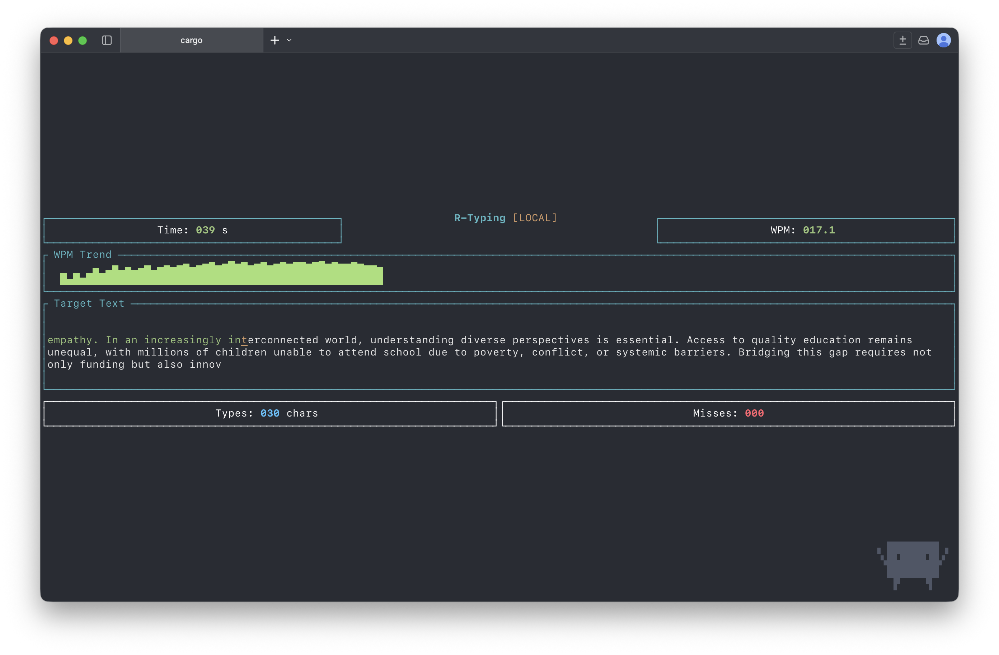
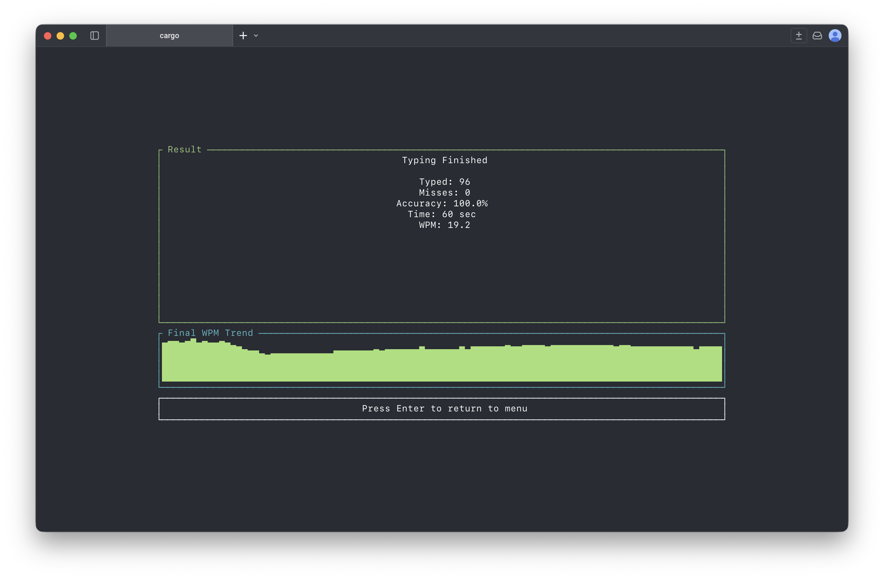

# R-Typing

R-Typing is a terminal-based typing game built with Rust. It provides a TUI powered by `ratatui` and `crossterm`, real-time WPM feedback, optional audio, and multiple text generation sources.

By default, the game starts from a title menu where you can choose local generation, Google AI Studio, or Groq for the next game. CLI flags can still preselect the generation source at launch.






## Features

- Terminal UI with title menu, config screen, typing screen, and result screen
- Real-time WPM, timer, typed character count, and miss count
- Optional BGM and typing feedback sound
- Local text generation with a 4-gram Markov chain
- Remote text generation through Google AI Studio or Groq
- Provider configuration saved under `~/.config/rtyping/`

## Run

```shell
# Start normally and choose a provider from the title menu
cargo run

# Start with Google AI Studio preselected as the generation source
cargo run -- --google

# Start with Groq preselected as the generation source
cargo run -- --groq

# Custom game settings
cargo run -- --timeout 30 --level 20 --sound
```

## Build

```shell
cargo build
cargo build --release
cargo install --path .
```

## CLI Options

```text
-t, --timeout <SECONDS>  Timer duration (default: 60)
-l, --level <LEVEL>      Target text length scale (default: 60)
    --freq <FREQUENCY>   Sound frequency in Hz (default: 80.0)
-s, --sound              Enable BGM and typing sound
    --google             Use Google AI Studio for text generation
    --groq               Use Groq for text generation
```

`--google` and `--groq` are mutually exclusive. If neither is specified, local generation is used.

## Title Menu

- Menu entries:
  - `Start Game`
  - `Start Game via Google AI Studio`
  - `Start Game via Groq`
  - `Config`
- `Up / Down`: move between the four menu entries
- `Enter`: confirm selection
- `h`: open or close help
- `Esc`: quit
- `Ctrl+c`: quit

## Config Screen

The `Config` screen lets you edit both Google AI Studio and Groq settings.

Each provider has these fields:

- `API URL`
- `API Key`
- `Model`

Controls:

- `Up / Down`: move focus
- `Backspace`: delete one character
- `Enter`: save configuration
- `Esc`: return to the title screen

Saved files:

- `~/.config/rtyping/config.json`
- `~/.config/rtyping/config.key`

`config.json` stores encrypted API key data. The encryption key is stored separately in `config.key`.

## Provider Notes

### Google AI Studio

- The final request URL is built as `API URL/` + `Model` + `:generateContent`
- The API key is appended as the `key` query parameter

Example:

```text
API URL: https://generativelanguage.googleapis.com/v1beta/models
Model: gemini-2.0-flash
Final URL: https://generativelanguage.googleapis.com/v1beta/models/gemini-2.0-flash:generateContent?key=YOUR_API_KEY
```

### Groq

- `API URL` should be the full chat completions endpoint you want to call
- `Model` is sent in the request body
- `API Key` is sent as a bearer token

## Text Length

The generated target text length follows `--level`. The current implementation uses roughly `level * 5` characters for both local and remote generation, so `--level` is a text-length scale rather than a literal word count.

## Development

```shell
cargo fmt
cargo test
```

## Cross Compilation

For Apple silicon macOS:

```shell
rustup target add aarch64-apple-darwin
cargo build --release --target=aarch64-apple-darwin
```

For Windows x86_64 GNU:

```shell
rustup target add x86_64-pc-windows-gnu
cargo build --release --target=x86_64-pc-windows-gnu
```
