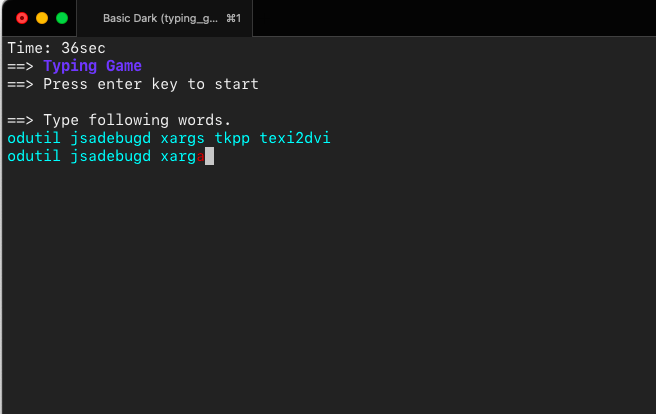
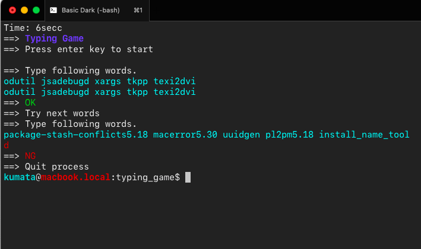

# 概要
Rust の学習目的で何か作りたかったので立ててみたみたいな。ひとまずリーダブルは捨てて作ってみたい typing アプリに挑戦。




## コマンド
とりあえず実行

```shell
cargo run
```

`~/.cargo/bin/` 配下にインストール

```shell
cargo check
cargo build --release --locked
cargo install --path .
```

## やる事リスト

- [x] 入力時の制限時間の実装
- [x] ユーザの入力
- [x] 出題文字列の取得
- [x] 乱数の基礎
- [x] 一部文字装飾
- [x] 制限時間カウンタ表示 (入力待ちしつつ別の場所に時間のカウンターを置くことが一番苦労した)
- [x] termion::Restore 後 io::stdin で Backspace が "^R\\n" 扱いになってしまうを修正する。(Canonicl mode をやめて Raw mode に移行することで解決)
- [x] Warp で `temion::clear::All` 前後の挙動がおかしいので対応する。(clear::All じゃなくて前後を clear する事で解決)
- [x] typo チェック
- [ ] wpm の集計
- [x] 文字装飾
- [ ] BGM 追加
- [ ] SE 追加


# 付録
## プロジェクト作成
```shell
cargo new rtyping
```

## クロスコンパイル
例えば Intel Mac で Apple Silicon Mac のバイナリを生成する場合。

### 準備
```shell
rustup target add aarch64-apple-darwin
```

### ビルド
```shell
cargo build --release --target=aarch64-apple-darwin
```
