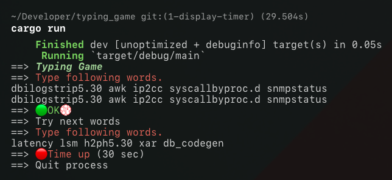

Rust の学習目的で何か作りたかったので立ててみたみたいな。

#### 実行

    cargo run

#### やったこと

  - 入力時の制限時間の実装 (thread::spawn)
  - ユーザの入力 (io::stdin)
  - 出題文字列の取得 (fs::read_dir)
  - 乱数の基礎 (rand::thread_rng)
  - 一部文字装飾

#### やること

  - 制限時間カウンタ
  - typo チェック
  - wpm の集計
  - 文字装飾

#### とにかくメモ
ユーザ入力をトリガに typo チェックするか、裏で typo チェッカをぐるぐる走らせるか？色をつけるとなるとユーザ入力をトリガにしたほうが良いかも？

カウントした制限時間を表示専用の関数に渡す。
